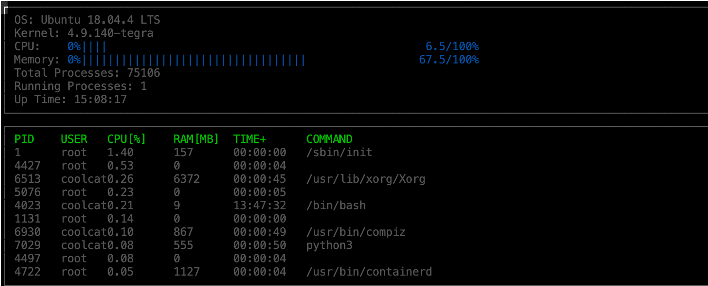

# System-Monitor-Linux

System Monitor for Linux

## ncurses
[ncurses](https://www.gnu.org/software/ncurses/) is a library that facilitates text-based graphical output in the terminal. This project relies on ncurses for display output.

Within the Udacity Workspace, `.student_bashrc` automatically installs ncurses every time you launch the Workspace.

If you are not using the Workspace, install ncurses within your own Linux environment: `sudo apt install libncurses5-dev libncursesw5-dev`

## Make
This project uses [Make](https://www.gnu.org/software/make/). The Makefile has four targets:
* `build` compiles the source code and generates an executable
* `format` applies [ClangFormat](https://clang.llvm.org/docs/ClangFormat.html) to style the source code
* `debug` compiles the source code and generates an executable, including debugging symbols
* `clean` deletes the `build/` directory, including all of the build artifacts

## Instructions

1. Clone the project repository: `git clone https://github.com/Coolgiserz/System-Monitor-Linux.git`

2. Build the project: `make -p build`

3. Execute the program: `./build/monitor`

## Future
- Make the display interactive
- Restructure the program to use abstract classes (interfaces) and pure virtual functions
- Port the program to Mac